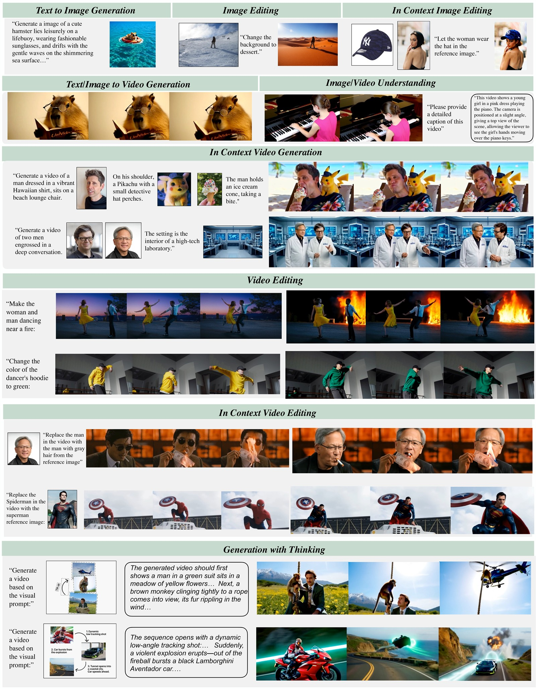
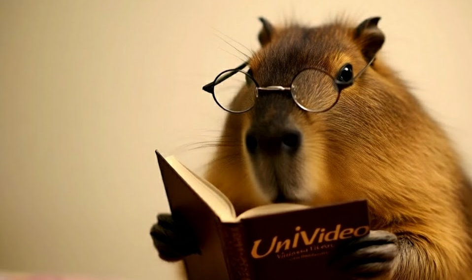

<p align="center" >
    
</p>

# <div align="center" >UniVideo: Unified Understanding, Generation, and Editing for Videos<div align="center">


<div align="center">

**[Cong Wei<sup>*,1,2</sup>](https://congwei1230.github.io/) &ensp;
[Quande Liu<sup>†,2</sup>](https://liuquande.github.io/) &ensp;
[Zixuan Ye<sup>2</sup>](https://openreview.net/profile?id=~Zixuan_Ye1) &ensp; 
[Qiulin Wang<sup>2</sup>](https://scholar.google.com/citations?user=3vvZdy8AAAAJ&hl=en) &ensp;
[Xintao Wang<sup>2</sup>](https://xinntao.github.io/)**

**[Pengfei Wan<sup>2</sup>](https://magicwpf.github.io/) &ensp;
[Kun Gai<sup>2</sup>](https://openreview.net/profile?id=~Kun_Gai1) &ensp;
[Wenhu Chen<sup>†,1</sup>](https://wenhuchen.github.io/)**
  <p>
    <sup>1</sup>University of Waterloo &nbsp;&nbsp;
    <sup>2</sup>Kling Team, Kuaishou Technology<br>
    <sup>*</sup>Work done during an internship at Kling Team, Kuaishou Technology
    <sup>†</sup>Corresponding author
  </p>
</div>

<p align="center">
  <a href='https://congwei1230.github.io/UniVideo/'></a>
  &nbsp;
  <a href="https://arxiv.org/abs/2510.08377"></a>
  &nbsp;
  <a href='https://huggingface.co/KlingTeam/UniVideo'></a>
</p>


<p align="center"></p>

## 🚀 Supported Tasks

Univideo is flexible in its input and output configurations, supporting a wide range of multimodal tasks:

<table>
  <thead>
    <tr>
      <th>Task</th>
      <th>Input Type</th>
      <th>Output</th>
      <th>Task ID</th>
      <th>Description</th>
      <th>Demo Input</th>
      <th>Demo Output</th>
    </tr>
  </thead>

  <tbody>
    <!-- Image / Video Understanding -->
    <tr>
      <td><b>Image/Video Understanding</b></td>
      <td>Image🖼️ / Video🎬 + Text📝</td>
      <td>Text📝</td>
      <td><code>understanding</code></td>
      <td>Multimodal analysis and captioning.</td>
      <td align="center">
        <br/>
        <!-- <sub>Image / Video</sub> -->
      </td>
      <td align="center">
        <!-- <br/> -->
        <sub>Text</sub>
      </td>
    </tr>
    <!-- Text-to-Image -->
    <tr>
      <td><b>Text-to-Image</b></td>
      <td>Text📝</td>
      <td>Image🖼️</td>
      <td><code>t2i</code></td>
      <td>Generating images from text prompts.</td>
      <td align="center">
        <!-- <br/> -->
        <sub>Prompt</sub>
      </td>
      <td align="center">
        <br/>
      </td>
    </tr>
    <!-- Text-to-Video -->
    <tr>
      <td><b>Text-to-Video</b></td>
      <td>Text📝</td>
      <td>Video🎬</td>
      <td><code>t2v</code></td>
      <td>Generating videos from text prompts.</td>
      <td align="center">
        <!-- <br/> -->
        <sub>Prompt</sub>
      </td>
      <td align="center">
        <br/>
        <!--  -->
      </td>
    </tr>
    <!-- Image-to-Video -->
    <tr>
      <td><b>Image-to-Video</b></td>
      <td>Image🖼️ + Text📝</td>
      <td>Video🎬</td>
      <td><code>i2v</code></td>
      <td>Animating a static image into a video.</td>
      <td align="center">
        <br/>
        <!-- <sub>Prompt</sub> -->
      </td>
      <td align="center">
        <br/>
      </td>
    </tr>
    <!-- Image Editing -->
    <tr>
      <td><b>Image Editing</b></td>
      <td>Image🖼️ + Text📝</td>
      <td>Image🖼️</td>
      <td><code>i2i_edit</code></td>
      <td>Instruction-based image editing.</td>
      <td align="center">
        <br/>
        <!-- <sub>Instruction</sub> -->
      </td>
      <td align="center">
        <br/>
        <!-- <sub>Edited Image</sub> -->
      </td>
    </tr>
    <!-- In-context Image Editing -->
    <tr>
      <td><b>In-context Image Editing</b></td>
      <td>Image🖼️ + Image🖼️ + Text📝</td>
      <td>Image🖼️</td>
      <td><code>i+i2i_edit</code></td>
      <td>Editing an image based on a reference image.</td>
      <td align="center">
        
        
        <!-- <sub>Source + Reference</sub> -->
      </td>
      <td align="center">
        <br/>
        <!-- <sub>Edited Image</sub> -->
      </td>
    </tr>
    <!-- In-context Generation -->
    <tr>
      <td><b>In-context Generation</b></td>
      <td>Image🖼️ × N + Text📝</td>
      <td>Image🖼️ / Video🎬</td>
      <td><code>multiid</code></td>
      <td>Multi-subject generation.</td>
      <td align="center">
        
        
        
        <!-- <sub>Multiple References</sub> -->
      </td>
      <td align="center">
        
      </td>
    </tr>
    <!-- Video Editing -->
    <tr>
      <td><b>Video Editing</b></td>
      <td>Video🎬 + Text📝</td>
      <td>Video🎬</td>
      <td><code>v2v_edit</code></td>
      <td>Instruction-based video manipulation and stylization.</td>
      <td align="center">
        <br/>
        <!-- <sub>Original Video</sub> -->
      </td>
      <td align="center">
        <br/>
      </td>
    </tr>
    <!-- In-context Video Editing -->
    <tr>
      <td><b>In-context Video Editing</b></td>
      <td>Image🖼️ + Video🎬 + Text📝</td>
      <td>Video🎬</td>
      <td><code>i+v2v_edit</code></td>
      <td>Reference-based manipulation: addition, deletion, swapping, and stylization.</td>
      <td align="center">
        <br/>
        <br/>
        <!-- <sub>Reference + Video</sub> -->
      </td>
      <td align="center">
        
      </td>
    </tr>
  </tbody>
</table>


## 🔔News
- [2026-06-03]: The training script and instructions are now available in [TRAINING.md](TRAINING.md).
- [2026-01-30]: UniVideo was accepted at ICLR 2026 🎉
- [2026-01-07]: Released [Code](https://github.com/KlingTeam/UniVideo) and [Model](https://huggingface.co/KlingTeam/UniVideo).
- [2025-10-09]: Released [Arxiv Preprint](https://arxiv.org/abs/2510.08377) and the [Project Page](https://congwei1230.github.io/UniVideo/)


## 📊Benchmark


### 1. Visual Understanding

| Model | MMBench | MMMU | MM-Vet |
| --- | ---: | ---: | ---: |
| LLaVA-1.5 | 36.4 | **67.8** | 36.3 |
| LLaVA-NeXT | 79.3 | 51.1 | 57.4 |
| OmniGen2 | 79.1 | 53.1 | 61.8 |
| BAGEL | **85.0** | 55.3 | **67.2** |
| UniVideo | <u>83.5</u> | <u>58.6</u> | <u>66.6</u> |

### 2. Text-to-Video Generation

| Model | VBench T2V |
| --- | ---: |
| CogVideoX | 81.61 |
| HunyuanVideo | 83.24 |
| Show-o2 | 81.34 |
| Wan2.1 | **84.70** |
| UniVideo | <u>83.48</u> |

### 3. Text-to-Image Generation

| Model | GenEval |
| --- | ---: |
| SD3-medium | 0.74 |
| FLUX.1-dev | 0.67 |
| Janus-Pro | 0.80 |
| BLIP3-o| **0.84** |
| BAGEL | <u>0.82</u> |
| OmniGen2 | 0.80 |
| UniVideo| 0.69 |

### 4. Image Editing

| Model | ImgEdit Overall | GEdit SC | GEdit PQ | GEdit Overall |
| --- | ---: | ---: | ---: | ---: |
| GPT-4o | 4.20 | 7.85 | 7.62 | 7.53 |
| Step1X-Edit | 3.06 | 7.09 | 6.76 | **6.70** |
| BAGEL | 3.20 | **7.36** | 6.83 | <u>6.52</u> |
| UniWorld-V1 | 3.26 | 4.93 | **7.43** | 4.85 |
| OmniGen2 | 3.44 | <u>7.16</u> | 6.77 | 6.41 |
| UniVideo | **3.83** | 7.08 | <u>7.08</u> | 6.41 |

## How to use

### 1. Installation

```
conda env create -f environment.yml
conda activate univideo
```

This environment is tested with:
- Python 3.11
- PyTorch 2.4.1 + CUDA 12.1
- diffusers 0.34.0
- transformers 4.51.3


Try this command if the conda create from yaml doesn't work 
```
conda create -n univideo python=3.11 -y
conda activate univideo
conda install pytorch==2.4.1 torchvision pytorch-cuda=12.1 -c pytorch -c nvidia -y
pip install -r requirements.txt
```

### 2. Download Checkpoint

Download the [Univideo checkpoint](https://huggingface.co/KlingTeam/UniVideo) to a local path for example `ckpts/`:

```
python download_ckpt.py --variant hidden
```

We provide two UniVideo checkpoint variants as described in Arxiv Preprint Section 3.2:

- **Variant 1 (img, video, txt -> mllm -> last layer hidden -> mmdit)**  
  Image, video, and text inputs are processed by the MLLM, and the final hidden states are fed into the MMDiT backbone.

- **Variant 2 (img, video, txt, queries -> mllm -> txt + queries last layer hidden -> mmdit)**  
  Image, video, text, and queries are processed by the MLLM. The final hidden states of text and queries are used as inputs to MMDiT.

Download the queries-based checkpoint with:

```
python download_ckpt.py --variant queries
```

Or download both variants without deleting either local directory:

```
python download_ckpt.py --variant all
```

### 3. Inference

We provide demo inference scripts to demonstrate how to load and run the UniVideo pipeline by setting up `pipeline_kwargs` on different inputs. Feel free to adapt these to your own inputs and setup.

#### 1. Basic Understanding & Generation
```bash
# Image/Video Captioning & Understanding
python univideo_inference.py --demo_task understanding --config configs/univideo_qwen2p5vl7b_hidden_hunyuanvideo.yaml

# Text-to-Video (T2V)
python univideo_inference.py --demo_task t2v --config configs/univideo_qwen2p5vl7b_hidden_hunyuanvideo.yaml

# Text-to-Image (T2I)
python univideo_inference.py --demo_task t2i --config configs/univideo_qwen2p5vl7b_hidden_hunyuanvideo.yaml

# Image-to-Video (I2V)
python univideo_inference.py --demo_task i2v --config configs/univideo_qwen2p5vl7b_hidden_hunyuanvideo.yaml
```

#### 2. Instruction-based Editing
```bash
# Image Editing 
python univideo_inference.py --demo_task image_edit --config configs/univideo_qwen2p5vl7b_hidden_hunyuanvideo.yaml

# Video Editing
python univideo_inference.py --demo_task video_edit --config configs/univideo_qwen2p5vl7b_hidden_hunyuanvideo.yaml

# Video Stylization
python univideo_inference.py --demo_task stylization --config configs/univideo_qwen2p5vl7b_hidden_hunyuanvideo.yaml
```


#### 3. In-Context Tasks

```Bash
# In context video generation
python univideo_inference.py --demo_task in_context_video_gen --config configs/univideo_qwen2p5vl7b_hidden_hunyuanvideo.yaml

# In context image editing
python univideo_inference.py --demo_task in_context_image_edit --config configs/univideo_qwen2p5vl7b_hidden_hunyuanvideo.yaml

# In context video editing
## addition
python univideo_inference.py --demo_task in_context_video_edit_addition --config configs/univideo_qwen2p5vl7b_hidden_hunyuanvideo.yaml
## swap
python univideo_inference.py --demo_task in_context_video_edit_swap --config configs/univideo_qwen2p5vl7b_hidden_hunyuanvideo.yaml
## style
python univideo_inference.py --demo_task in_context_video_edit_style --config configs/univideo_qwen2p5vl7b_hidden_hunyuanvideo.yaml
```

#### 4. Multi-GPU README Sweep

To run the README demo tasks across multiple local GPUs while keeping each
task's default hyperparameters, use:

```bash
python scripts/run_readme_inference_sweep.py \
  --gpus 0,1,2 \
  --max-parallel 3 \
  --config configs/univideo_qwen2p5vl7b_hidden_hunyuanvideo.yaml \
  --output-root outputs/readme-inference
```

The launcher writes one log per task under `outputs/readme-inference/logs`.
Lower `--max-parallel` if checkpoint loading saturates local storage.

#### Univideo variant 2
To use the **Queries-based** version of UniVideo, simply update the configuration flag.
```
--config configs/univideo_qwen2p5vl7b_queries_hunyuanvideo.yaml
```


### 4. Training

We provide an example training setting using open-source data so users can run a
small training job and verify the training pipeline. See
[TRAINING.md](TRAINING.md) for the data schema, dataset preparation details,
and full training options.

```bash
python download_ckpt.py --variant hidden
python -m pip install --target .deps/pyarrow pyarrow
bash scripts/prepare_smoke_data.sh
torchrun --standalone --nproc_per_node 8 \
  train/train_univideo.py configs/train_multitask_129f_hybrid_smoke.yaml
```


### 5. Evaluation

We provide the scripts for evaluating UniVideo on GenEval, ImgEdit, GEdit and Vbench benchmarks.  Check out [EVAL.md](EVAL.md)

## Acknowledgement

- [HunyuanVideo](https://github.com/Tencent-Hunyuan/HunyuanVideo): the base video generation model used in this work. Thanks to the authors for their excellent contribution.
- [Qwen2.5-VL](https://github.com/QwenLM): the base vlm model used in this work. Thanks to the authors for their excellent contribution.
- [MetaQueries](https://xichenpan.com/metaquery/): we adopt their query implementation. Thanks to the authors for their excellent contribution.

## 🌟 Citation

If you find UniVideo useful for your research and applications, please cite using this BibTeX:

```bibtex
@article{wei2025univideo,
  title={Univideo: Unified understanding, generation, and editing for videos},
  author={Wei, Cong and Liu, Quande and Ye, Zixuan and Wang, Qiulin and Wang, Xintao and Wan, Pengfei and Gai, Kun and Chen, Wenhu},
  journal={arXiv preprint arXiv:2510.08377},
  year={2025}
}
```
